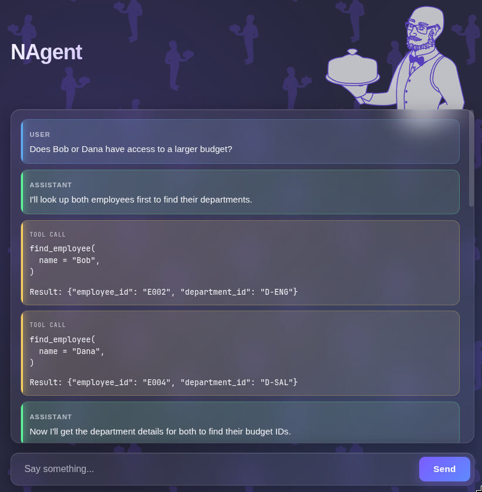

# Pass the Butter

Some initial experiements with Langraph



## Usage

```bash
 export ANTHROPIC_API_KEY=sk-....

./dev_server.sh
#OR
uvicorn server.main:app --reload
```

## Interesting Test Prompts

- please take dana's unspent budget and allocate it to bob
